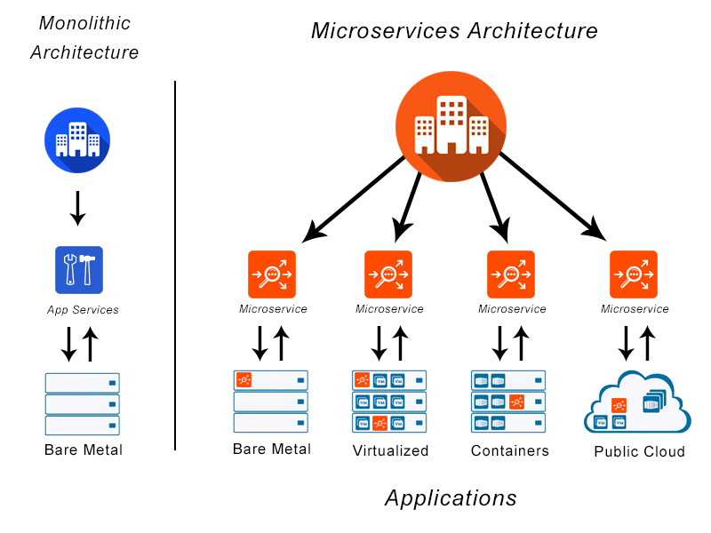

# Microservices with Docker and Kubernetes



## Microservices

### What are microservices?

Microservices are a software development technique—a variant of the service-oriented architecture (SOA) architectural style that structures an application as a collection of loosely coupled services, in a service-oriented architecture, services are fine-grained and the protocols are lightweight.

### Why microservices?

Microservices are a way to break up an application into small, independent services. Each service is a small application that runs in its own process and communicates with other services using a lightweight mechanism, often an HTTP resource API. These services are built around business capabilities and independently deployable by fully automated deployment machinery. There is a bare minimum of centralized management of these services, which may be written in different programming languages and use different data storage technologies.

### What are the benefits of microservices?

| Benefits | Description |
| --- | --- |
| **Scalability** | Microservices are small and independent, so they can be scaled up or down independently. |
| **Resilience** | If one microservice fails, the others remain unaffected. |
| **Technology diversity** | Microservices can be written in different programming languages and use different data storage technologies. |
| **Loose coupling** | Microservices are loosely coupled, so they can be developed, tested, and deployed independently. |

## Docker and Kubernetes


### What is Docker?

Docker is a set of platform as a service (PaaS) products that use OS-level virtualization to deliver software in packages called containers. Containers are isolated from one another and bundle their own software, libraries and configuration files; they can communicate with each other through well-defined channels. All containers are run by a single operating-system kernel and are thus more lightweight than virtual machines.

### Why Docker?

Docker is a tool designed to make it easier to create, deploy, and run applications by using containers. Containers allow a developer to package up an application with all of the parts it needs, such as libraries and other dependencies, and ship it all out as one package. By doing so, thanks to the container, the developer can rest assured that the application will run on any other Linux/Windows machine regardless of any customized settings that machine might have that could differ from the machine used for writing and testing the code.

## Kubernetes

### What is Kubernetes?

Kubernetes is an open-source system for automating deployment, scaling, and management of containerized applications. It groups containers that make up an application into logical units for easy management and discovery. Kubernetes builds upon 15 years of experience of running production workloads at Google, combined with best-of-breed ideas and practices from the community.

### Why Kubernetes?

Kubernetes is a portable, extensible, open-source platform for managing containerized workloads and services, that facilitates both declarative configuration and automation. It has a large, rapidly growing ecosystem. Kubernetes services, support, and tools are widely available.

## Docker Setup

### Docker Installation - Windows

1. Download the Docker Desktop Installer from [here](https://hub.docker.com/editions/community/docker-ce-desktop-windows).
2. Run the installer and follow the instructions.
3. Once the installation is complete, open the Docker Desktop application.
4. Install WSL 2 backend by following the instructions [here](https://docs.microsoft.com/en-us/windows/wsl/install-win10).

### Alias

```bash
alias docker="winpty docker"
```

### Docker Commands

```bash
# List all running containers
docker ps

# List all containers
docker ps -a

# List all images
docker images
```
